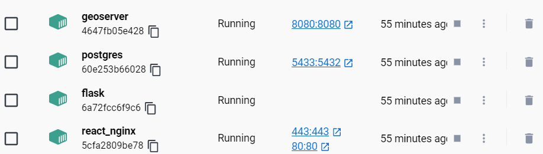

# Dockerized Geoserver, Postgres-PostGis , Flask , React , Nginx



## Requirements
Before you run this application make sure you have this installed in your machine:

- [Docker Desktop](https://www.docker.com/products/docker-desktop)
- [docker-compose](https://docs.docker.com/compose/install/)

## Usage
This repository includes a template for build a web application that uses Flask and React frameworks on the back-end and front-end sides, a Postgres database with the PostGis extension, and a geoserver for working with spatial data. To customize this template for your project, just follow the steps below:

- #### Flask app:
    - copy your flask app files to [```./services/flask```](./services/flask)
    
    - copy app requirements to [```./services/flask/requirements.txt```](./services/flask/requirements.txt)

    - copy environment variables to [```./.env```](./.env)

    - change command of backend service in [```docker-compose.yml```](./docker-compose.yml) according to your app structure

- #### React app:
    - copy your react app files to [```services/react_nginx```](./services/react_nginx) that contains [```src```](./services/react_nginx/src) & [```public```](./services/react_nginx/public) folder
    
    - copy app dependencies to [```services/react_nginx/package.json```](./services/react_nginx/package.json)
    
    - copy environment variables to [```./.env```](./.env)
    
- #### Nginx:
    - copy  [```certificate.crt```](./services/react_nginx/certificate.crt) and [```privateKey.key```](./services/react_nginx/privateKey.key) to [```services/react_nginx```](./services/react_nginx) to use ssl

    - change [```services/react_nginx/nginx.conf```](./services/react_nginx/nginx.conf) if you need

- #### Postgres - PostGis:
    - Specify the environment variables in the [```./.env```](./.env):
      ```
      - POSTGRES_USER=<your postgres user>
      - POSTGRES_PASSWORD=<your postgres password>
      - POSTGRES_DB=<your postgres database>
      ```
    - copy your sql files that you want to be executed after build to [```./initdb.d```](./initdb.d)
    
- #### Geoserver:
    - Specify the environment variables in the [```./.env```](./.env):
      ```
      - GEOSERVER_ADMIN_USER=your geoserver admin user>
      - GEOSERVER_ADMIN_PASSWORD=<your geoserver admin password>
      ```
      
    - copy your geoserver data directory to [```services/geoserver/data```](./services/geoserver/data). If this directory is empty it will be populated with the standard geoserver sample data directory.
    
## Running Locally
- To run the application locally, run this command

```
    docker-compose up
```

